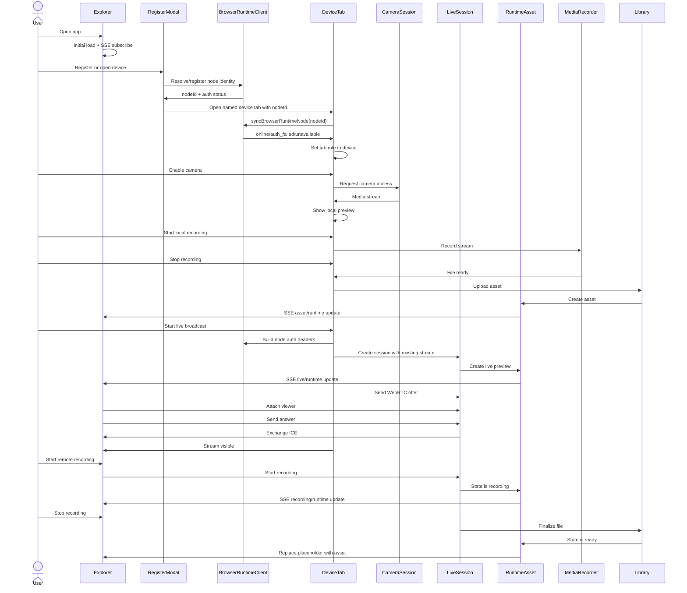

```mermaid
sequenceDiagram
actor User
participant Explorer
participant RegisterModal
participant BrowserRuntimeClient
participant DeviceTab
participant CameraSession
participant LiveSession
participant RuntimeAsset
participant MediaRecorder
participant Library

User->>Explorer: Open app
Explorer->>Explorer: Initial load + SSE subscribe

User->>RegisterModal: Register or open device
RegisterModal->>BrowserRuntimeClient: Resolve/register node identity
BrowserRuntimeClient->>RegisterModal: nodeId + auth status
RegisterModal->>DeviceTab: Open named device tab with nodeId

DeviceTab->>BrowserRuntimeClient: syncBrowserRuntimeNode(nodeId)
BrowserRuntimeClient->>DeviceTab: online/auth_failed/unavailable
DeviceTab->>DeviceTab: Set tab role to device

User->>DeviceTab: Enable camera
DeviceTab->>CameraSession: Request camera access
CameraSession->>DeviceTab: Media stream
DeviceTab->>DeviceTab: Show local preview

User->>DeviceTab: Start local recording
DeviceTab->>MediaRecorder: Record stream
User->>DeviceTab: Stop recording
MediaRecorder->>DeviceTab: File ready
DeviceTab->>Library: Upload asset
Library->>RuntimeAsset: Create asset
RuntimeAsset->>Explorer: SSE asset/runtime update

User->>DeviceTab: Start live broadcast
DeviceTab->>BrowserRuntimeClient: Build node auth headers
DeviceTab->>LiveSession: Create session with existing stream
LiveSession->>RuntimeAsset: Create live preview
RuntimeAsset->>Explorer: SSE live/runtime update

DeviceTab->>LiveSession: Send WebRTC offer
Explorer->>LiveSession: Attach viewer
Explorer->>LiveSession: Send answer
LiveSession->>Explorer: Exchange ICE
DeviceTab->>Explorer: Stream visible

User->>Explorer: Start remote recording
Explorer->>LiveSession: Start recording
LiveSession->>RuntimeAsset: State is recording
RuntimeAsset->>Explorer: SSE recording/runtime update

User->>Explorer: Stop recording
LiveSession->>Library: Finalize file
Library->>RuntimeAsset: State is ready
RuntimeAsset->>Explorer: Replace placeholder with asset
``` 